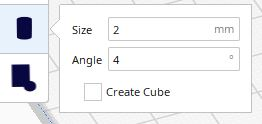
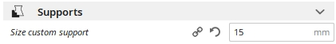

# Custom Supports plugin for Cura

Cura plugin which enables you to add custom cylindrical and cubic supports. It is based on the CustomSupports plugin version of Krasimir Stenanov Custom : http://lokspace.eu/cura-custom-supports-plugin/
Source code on Github : https://github.com/lokster/cura-custom-supports/tree/master/CustomSupports

The initial version was tested on Cura 4.5

Installation
----
First, make sure your Cura version is 3.6 or newer. 

**Manual Install**
Download & extract the repository as ZIP or clone it. Copy the files/plugins/CustomSupports directory to:
- on Windows: [Cura installation folder]/plugins/CustomSupports
- on Linux: ~/.local/share/cura/[YOUR CURA VERSION]/plugins/CustomSupports (e.g. ~/.local/share/cura/3.4/plugins/CustomSupports)
- on Mac: ~/Library/Application Support/cura/[YOUR CURA VERSION]/plugins/CustomSupports

How to use
----
- Load some model in Cura and select it
- Uncheck the "Generate Support" checkbox in the right panel **(if you want to use ONLY custom supports)**
- Click on the "Custom Supports Cylinder" button on the left toolbar
- Change de value for the support *Size* in numeric input field in the tool panel if necessary

- Click anywhere on the model to place support cylinder there
- **Clicking existing support cylinder deletes it**

* The length of the support is automaticaly set from the pick point to the construction plate of the printer.
* The default size of the supports is define by using the value of size_custom_support in the support section (parameter added by this plugin). size_custom_support = Support diameter for the cylinder and X / Y Sibe of the cubic shape.

With the CheckBox 'Create cube', it's possible to switch the geometry between a cylinder or a cubic support

>Note: it's easier to add/remove supports when you are in "Solid View" mode
	
