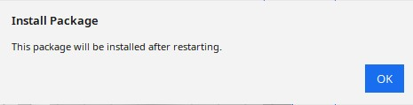
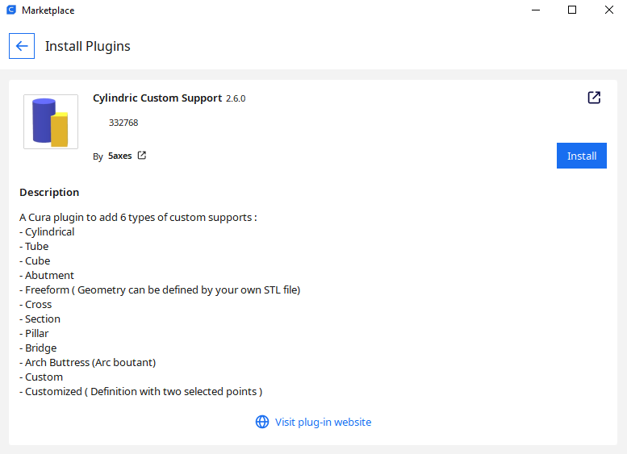
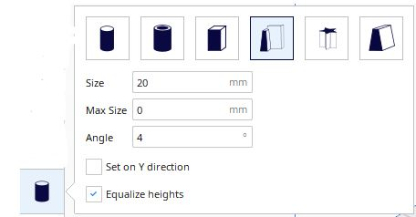
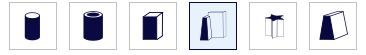
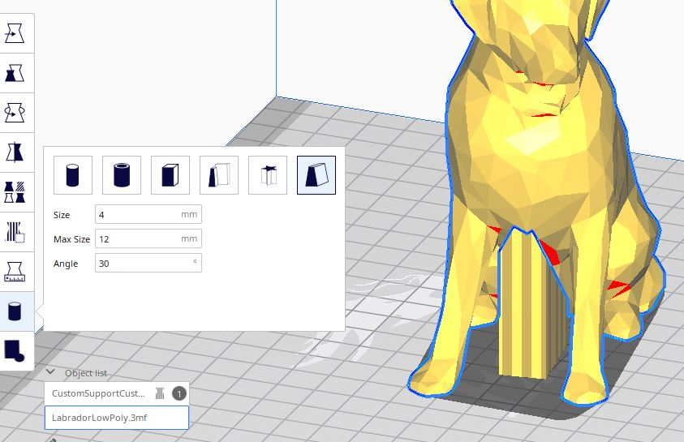

# Custom Supports Plugin for Cura

Cura plugin which enables you to add custom different support types. It was originaly based on the ***Support Eraser plugin*** code of *Ultimaker BV*. But instead of creating only a fixed sized cube **"anti_overhang_mesh"**, this plugin offer you the possibility to define a custom sized shape **"support_mesh"** element.

Source code on Github : [https://github.com/Ultimaker/Cura/tree/master/plugins/SupportEraser](https://github.com/Ultimaker/Cura/tree/master/plugins/SupportEraser)

This plugin offer now much more possibilities :
----

- Possibility to define cylindrical / squarred / custom by 2 points / tube / abutment support style / Freeform Support
- Possibility to define the support size
- Visualisation of the support on the total height
- Possibility to add an angle to obtain a conical support
- Possibility to limit the size of the bottom of the support in case of tapered support

**New 2.4.0**

- Possibility to define a max size for the base of the support

**New 2.5.X**

- Possibility to define freeform support via STL File

**New 2.6.X**

Updated for Cura 5.0

The initial version was tested on Cura 4.5 but last release tested from 4.5 to 5.0

## Installation

### Manual Installation

Download the latest release from this [repository](https://github.com/5axes/CustomSupportCylinder/releases)

Drop the curapackage according to your Cura release in the 3d viewport in Cura as if you were opening a 3d model. You will then be prompted to restart Cura.

### Automatic installation for Cura 4.X and Cura 5.X

First, make sure your Cura version is 4.5 or newer. This plugin is now avalaible in the Cura marketplace. So you can install it automaticaly from this place:

[Cylindric Custom Support on Ultimaker Market place](https://marketplace.ultimaker.com/app/cura/plugins/5axes/CustomSupportCylinder)

## How to use

* Load a model in Cura and select it

* Click on the "Custom Supports Cylinder" button on the left toolbar
* With the 6 buttons in the plugin windows, it's possible to switch the geometry between a cylinder, a tube, a cubic, an abutment, a freeform or a custom support.
* Change the value for the support *Size* in numeric input field in the tool panel if necessary
* Change the value for the support *Angle* in numeric input field in the tool panel if necessary **(Version 1.0.03)**
* You can limit the size of the tappered support by fixing a Max Size Value if necessary **(Version 2.4.0)**
* Change the value for the support *Interior size* in numeric input field in the tool panel if necessary **(Version 2.2.0 for Tube support)**

Select the type of support to create with the buttons in the support plugin interface :

- Click anywhere on the model to place support cylinder there
* The length of the support is automaticaly set from the pick point to the construction plate.

- **Clicking existing support deletes it**

- **Clicking existing support + Ctrl** switch automaticaly to the Translate Tool to modify the position of the support.

- **Clicking existing support + Alt** this shorcut allow to add a support on a existing support.

- Before to slice your model, uncheck the "Generate Support" checkbox in the right panel **(if you want to use ONLY custom supports)**

>Note: it's easier to add/remove supports when you are in "Solid View" mode

## Modifications

- Version 1.03 : Possibility to define conical support

	
- Version 2.0.0 : Possibility to define custom support

To create custom support you need to clic 2 points on the model.

- Version 2.1.0 : Possibility to define Abutment support

- Version 2.2.0 : Possibility to define a Tube as support

- Version 2.3.0 : For Abutment support possibility to create directly the Support on the Y direction and possibility to unify the supports heights

- Version 2.4.0 : Add Max Size Option in oder to limite the base size.

- Version 2.4.1 : By default Support Mesh are not define as Drop Down Support Mesh. This option will offer the possibility to define new shape for the mesh. But this modification must be validated by the users before going further in the development.

- Version 2.5.X : New option for Freeform Support : Can add a support with a form freely defined by an STL file ( Model must have the size 1x1x1 bo be modified according to the Size value and the height ) :

- Version 2.6.X : Update for Cura 5.0
- 
# Youtube Video

